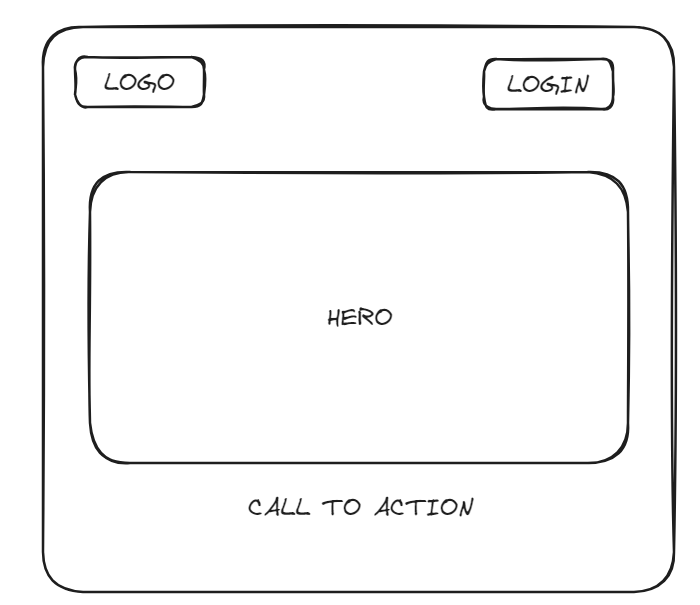
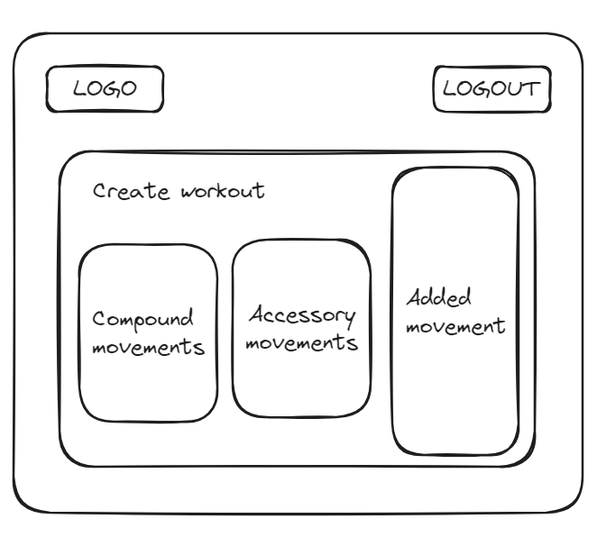

# Habitrack

## Overview

Habitrack is your one stop shop for accountability for all things health, fitness and lifestlye. The app educates you on how to structure a workout and allows you to plan your sessions around your life. It also gives you guidance on meal prep plans. The daily tracker helps you to check in on healthy habits such as reaching your step goals, drinking 8 glasses of water etc, with the option to add in your own daily non-negotiables.

### Problem

Most fitness apps require you to buy someone elses plan. This app however, combats that and allows you to be in the driving seat without the costs of a trainer. Additionally, being able to track your time, weights lifted, body fat loss etc. with visual representation, is much easier than tracking on your notes app or Excel spreadsheet.

### User Profile

The app can be used by anyone who wants to lead a more organised life and have some control over health, fitness and lifestyle habits.

They can use this on their phones or computers daily.

Considerations include: fitness goals and time available to train.

### Features

- As a user, I want to be able to design my own workout in way recommended by science for results
- As a user, I want to build my sessions according to the time I have available
- As a user, I want to be able to track my progress over a given time period
- As a user, I want to track my other habits over a period of time

## Implementation

### Tech Stack

- React
- Express
- MySQL

### APIs

YouTube API for video demonstrations on how to complete exercises.

### Sitemap

- Home page
- Register
- Login
- Personal dashboard
- Workout session

### Mockups

Landing Page

Login/Sign Up Page

New user dashboard

Existing user dashboard

Progress tracker

Create workout

Meal tracker

### Data

### Endpoints

- / = home
- /login = login page
- /signup = signup page
- /userid = dashboard
- /userid/workouts = new workout page
- /userid/workouts/compoundmovements = compound movement list
- /userid/workouts/accessorymovements = accessory movement list
- /userid/mealplans = new plan page
- /userid/mealplans/afrocaribfood = Afro-Caribbean food
- /userid/mealplans/westernfood = Western food
- /userid/tracker = progress tracker

### Auth

No authorisation as this will be based on a single user.

## Roadmap

Scope your project as a sprint. Break down the tasks that will need to be completed and map out timeframes for implementation. Think about what you can reasonably complete before the due date. The more detail you provide, the easier it will be to build.

## Nice-to-haves

- Login functionality
- Challenges
- Streaks
- Community
