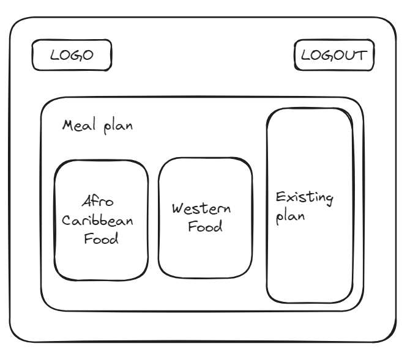
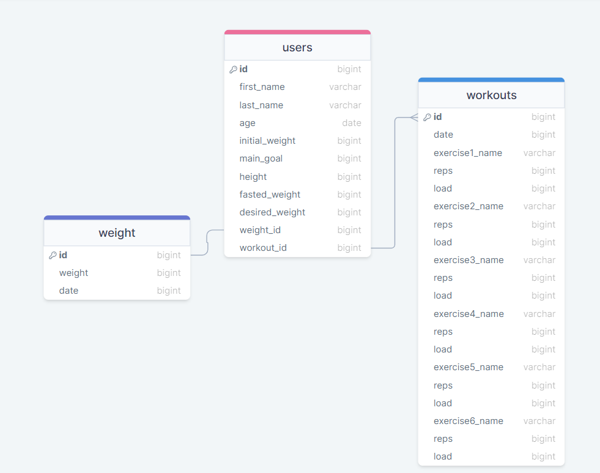

# Habitrack

## Overview

Habitrack is your one stop shop for accountability for all things health, fitness and lifestlye. The app educates you on how to structure a workout and allows you to plan your sessions around your life. It also gives you guidance on meal prep plans. The daily tracker helps you to check in on healthy habits such as reaching your step goals, drinking 8 glasses of water etc, with the option to add in your own daily non-negotiables.

### Problem

Most fitness apps require you to buy someone elses plan. This app however, combats that and allows you to be in the driving seat without the costs of a trainer. Additionally, being able to track your time, weights lifted, body fat loss etc. with visual representation, is much easier than tracking on your notes app or Excel spreadsheet.

### User Profile

The app can be used by anyone who wants to lead a more organised life and have some control over health, fitness and lifestyle habits.

They can use this on their phones or computers daily.

Considerations include: fitness goals and time available to train.

### Features

- As a user, I want to be able to design my own workout in way recommended by science for results
- As a user, I want to build my sessions according to the time I have available
- As a user, I want to be able to track my progress over a given time period
- As a user, I want to track my other habits over a period of time

## Implementation

### Tech Stack

- React
- Express
- MySQL

### APIs

YouTube API for video demonstrations on how to complete exercises.

### Sitemap

- Home page
- Register
- Login
- Personal dashboard
- Workout session

### Mockups

Landing Page

Login/Sign Up Page

New user dashboard

Existing user dashboard

Progress tracker

Create workout

Meal tracker

### Data

### Endpoints

- / = home
- /login = login page
- /signup = signup page
- /user/id = dashboard
- /user/id/workouts = new workout page
- /user/id/workouts/compoundmovements = compound movement list
- /user/id/workouts/accessorymovements = accessory movement list
- /user/id/mealplans = new plan page
- /user/id/mealplans/afrocaribfood = Afro-Caribbean food
- /user/id/mealplans/westernfood = Western food
- /user/id/tracker = progress tracker

### Auth

No authorisation as this will be based on a single user.

## Roadmap

#### Wednesday 24th Jan

- Set up project on Github
- Create logo
- Create landing page

#### Thurs 25th Jan - Fri 26th Jan

- Login/sign up page front end and back end

#### Sat 27th Jan - Sun 28th Jan

- New user dashboard front end and back end

#### Mon 29th Jan - Tues 30th Jan

- 'Create workout' page front end and back end

#### Wed 31st Jan - Thurs 1st Feb

- Start workout page

#### Fri 2nd Jan - Sat 3rd Feb

- Tracker page

#### Sun 4th Feb

- Fix bugs and submit

## Nice-to-haves

- Login functionality
- Challenges
- Streaks
- Community

## Instructions

- Clone both the front end and back end projects
- Ensure MySQL is running
- "npm i" in the terminal for both projects
- "npm start" in the terminal for both projects
